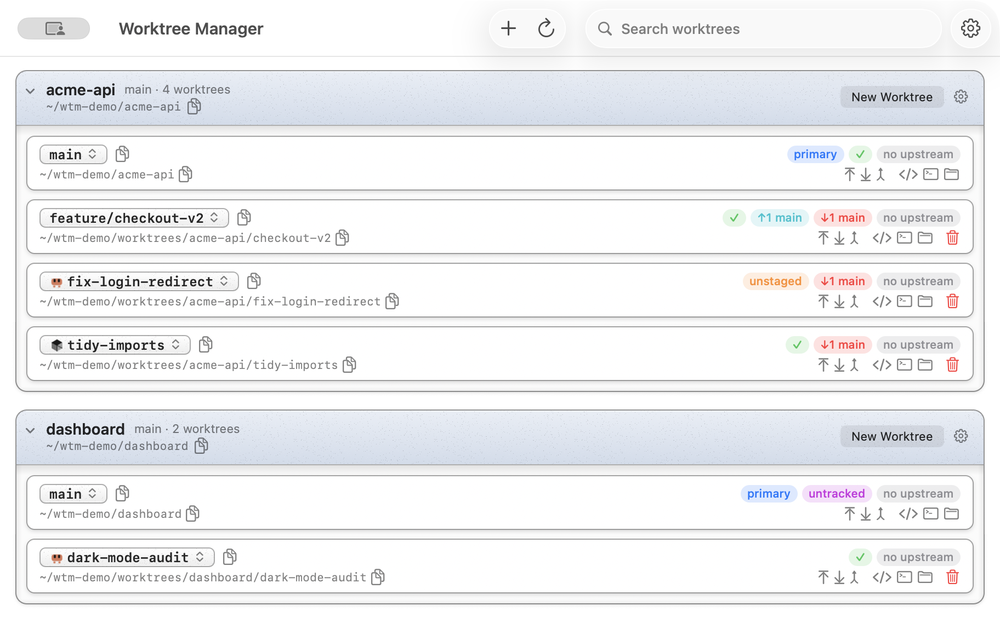

# Worktree Manager

A compact macOS app for managing [git worktrees](https://git-scm.com/docs/git-worktree)
across multiple repositories, written in Rust against AppKit.

The main window is a tree: repositories at the top level, their worktrees nested
underneath — each with branch, path, live git status, and one-click actions.



## Features

- **Status at a glance** — staged / unstaged / untracked changes, commits ahead of
  or behind the repo's primary branch, unpushed commits, `✓` for clean trees, and a
  "folder missing" badge for worktrees whose directory was deleted outside the app.
- **One-click git ops per worktree** — push (sets upstream on first push), pull
  (fast-forward only), pull the primary branch in, and a branch switcher with a
  fuzzy finder, backed by plain `git switch`.
- **Create worktrees** — new or existing branch, based on any ref. A new branch
  defaults to branching off `origin/<trunk>` (the latest fetched remote state)
  when the remote is present, falling back to the local trunk otherwise; the
  base ref is editable. Worktrees land in `<worktrees root>/<repo name>/<branch-slug>`
  and the repo's init command (e.g. `pnpm i`) runs automatically in the new tree.
- **Background fetch** — every repo is `git fetch`ed automatically in the
  background (every 8m43s), so ahead/behind and unpushed counts — and the
  `origin/<trunk>` base ref — stay current without a manual pull.
- **Delete with a safety ladder** — the path is verified against git's own worktree
  list, the branch is revalidated at delete time (stale rows refuse), and
  `git worktree remove` runs _without_ `--force` first: deleting a dirty worktree
  requires an explicit second "Force delete — discard changes" confirmation.
  The primary working tree can never be deleted.
- **Follows what you do elsewhere** — each worktree is watched with FSEvents, so a
  `git switch` or a commit in your terminal updates that row within a moment.
- **Open in editor / terminal / Finder** — the editor command is configurable and
  takes a `{path}` placeholder (e.g. `code {path}`); the terminal is whichever one
  you have set as the system default.
- **Keyboard throughout** — arrow keys move a selection through the tree, ⌘N
  creates a worktree in the selected repo, space or ⌘T opens the branch switcher,
  ⌘F searches, and Tab reaches every button in every row.
- **Agent branches read cleanly** — a `claude/` or `cursor/` prefix is drawn as
  that agent's mark, so the part of the name that identifies the work is what you
  see.
- **Updates itself** — an installed copy checks the latest release shortly after
  launch and every six hours, and installs a newer signed build in the
  background; the notice bar then offers a restart. It only ever installs a
  notarised build signed by the same team as the running copy, so a tampered
  download is refused. Builds you make yourself never update.
- **Persistent config** — worktrees root, editor command, and the repo list (with
  per-repo primary branch and init command) survive relaunches.
- **Native, and quick about it** — real AppKit views, an immutable model snapshot,
  and targeted row reloads: the UI never waits on git.

## Install

Download the DMG from the [latest release](../../releases/latest) and drag the
app to Applications. Builds are signed and notarised, so it opens with a
double-click.

## Build from source

Requires a [Rust toolchain](https://rustup.rs) and git ≥ 2.36.

```sh
cargo run                      # run a dev build
scripts/bundle.sh              # release build → target/bundle/Worktree Manager.app
scripts/bundle.sh --install    # …and copy it to /Applications
```

## Development

```sh
cargo test                     # unit tests + an end-to-end core test on a temp repo
cargo fmt                      # format
WTM_USER_DATA=/tmp/wtm cargo run    # sandboxed config, leaves the real one alone
WTM_APPEARANCE=dark cargo run       # force an appearance
RUST_LOG=info cargo run             # timings for refreshes and git runs
```

[docs/architecture.md](docs/architecture.md) explains how the crates fit
together and why the fiddly parts are the way they are;
[CLAUDE.md](CLAUDE.md) carries the conventions and the AppKit lessons.

## Configuration

| Setting        | Scope    | Default                                                |
| -------------- | -------- | ------------------------------------------------------ |
| Worktrees root | global   | `~/.claude-worktrees`                                  |
| Editor command | global   | `code`                                                 |
| Primary branch | per repo | auto-detected from `origin/HEAD`, else `main`/`master` |
| Init command   | per repo | _(empty)_                                              |

Settings apply as you type them — there is no Save button. Config lives in
`~/Library/Application Support/Worktree Manager/config.json`.

Adding a repository resolves the picked folder to its primary working tree (even
if you pick a linked worktree) and lists all existing worktrees immediately. The
picker takes several folders at once, and you can also drag repository folders
straight onto the app's Dock icon — including when the app isn't running.
